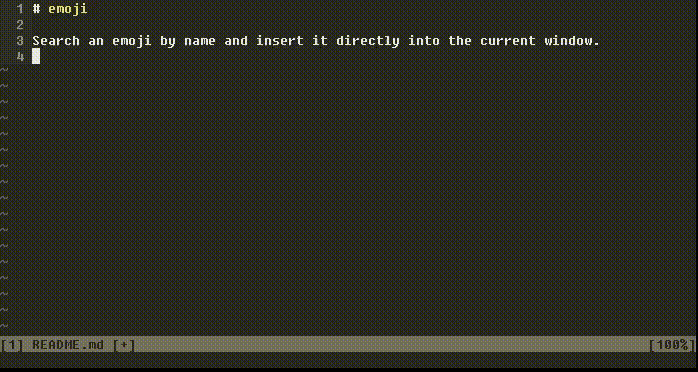

# emoji

Search an emoji by name and insert it directly into the current window. You
use it like this:

I use i3 and I bound it to `<super>+z`. I suggest you do something similar.

## Dependencies

- [rofi](https://github.com/DaveDavenport/rofi/) or [dmenu](https://tools.suckless.org/dmenu/)
- [xdotool](https://www.semicomplete.com/projects/xdotool/)

## Installation

It's one file so you just copy it to an executable path. Don't forget to
install the dependencies tho.
